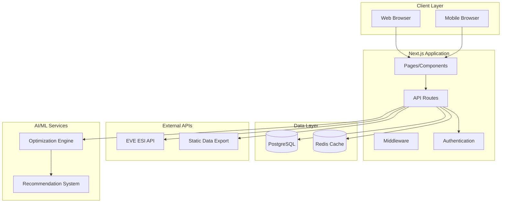

# Design Document

## Overview

The EVE Online Optimizer is a comprehensive web platform built with Next.js 15 that leverages the EVE Online ESI API to provide AI-powered optimization recommendations for players. The platform combines real-time game data with advanced algorithms to deliver personalized ship fitting recommendations, career guidance, and strategic optimization across all aspects of EVE Online gameplay.

The system architecture follows a modern full-stack approach with server-side rendering, API route handlers, and a PostgreSQL database for persistent data storage. Redis is used for caching frequently accessed data and rate limiting ESI API calls. The platform integrates with EVE's Dogma system for accurate attribute calculations and provides real-time recommendations based on character skills, assets, and market conditions.

## Architecture

### High-Level Architecture



### Technology Stack

- **Frontend**: Next.js 15 with App Router, React 18, TypeScript
- **Backend**: Next.js API Routes, Node.js runtime
- **Database**: PostgreSQL with postgres.js client
- **Cache**: Redis with ioredis client
- **Authentication**: NextAuth.js with ESI OAuth
- **Styling**: Tailwind CSS with responsive design
- **Deployment**: Vercel or similar platform
- **Monitoring**: Built-in Next.js analytics and custom metrics

## Components and Interfaces

### Core Components

#### 1. Authentication System
- **ESI OAuth Integration**: Handles EVE Online SSO authentication
- **Session Management**: Secure session handling with JWT tokens
- **Scope Management**: Manages ESI API scopes and permissions
- **Token Refresh**: Automatic token refresh for long-lived sessions

#### 2. Data Synchronization Engine
- **Character Data Sync**: Fetches and updates character information
- **Asset Management**: Tracks character assets and locations
- **Skill Monitoring**: Real-time skill queue and training progress
- **Market Data Integration**: Current market prices and trends

#### 3. Optimization Engine
- **Dogma Calculator**: Accurate attribute calculations using EVE's Dogma system
- **Fit Optimizer**: Generates optimal ship fittings based on constraints
- **Skill Planner**: Creates efficient skill training plans
- **Performance Analyzer**: Calculates ship performance metrics

#### 4. Recommendation System
- **Career Path Analysis**: Analyzes player goals and recommends paths
- **Mission Optimizer**: Suggests optimal missions and fittings
- **Market Opportunities**: Identifies profitable trading opportunities
- **Planetary Interaction**: Optimizes PI setups and chains

#### 5. User Interface Components
- **Dashboard**: Overview of character status and recommendations
- **Ship Fitting Tool**: Interactive fitting interface with real-time stats
- **Skill Planner**: Visual skill training timeline and priorities
- **Market Browser**: Market analysis and opportunity viewer

### API Interfaces

#### ESI Integration Layer
```typescript
interface ESIClient {
  authenticate(scopes: string[]): Promise<AuthResult>
  getCharacterInfo(characterId: number): Promise<Character>
  getCharacterSkills(characterId: number): Promise<Skills>
  getCharacterAssets(characterId: number): Promise<Asset[]>
  getMarketData(regionId: number, typeId: number): Promise<MarketData>
}
```

#### Optimization Service Interface
```typescript
interface OptimizationService {
  calculateShipStats(fitting: Fitting, character: Character): Promise<ShipStats>
  optimizeFitting(constraints: FittingConstraints): Promise<Fitting[]>
  generateSkillPlan(goals: SkillGoals, character: Character): Promise<SkillPlan>
  recommendCareerPath(preferences: CareerPreferences): Promise<CareerRecommendation[]>
}
```

#### Data Access Layer
```typescript
interface DataRepository {
  saveCharacter(character: Character): Promise<void>
  getCharacterByEveId(eveId: number): Promise<Character | null>
  saveFitting(fitting: Fitting): Promise<number>
  getFittingsByCharacter(characterId: number): Promise<Fitting[]>
  cacheMarketData(data: MarketData, ttl: number): Promise<void>
  getCachedMarketData(key: string): Promise<MarketData | null>
}
```

## Data Models

### Core Data Models

#### Character Model
```typescript
interface Character {
  id: number
  eveCharacterId: number
  name: string
  corporationId: number
  allianceId?: number
  skills: Skill[]
  implants: Implant[]
  attributes: CharacterAttributes
  walletBalance: number
  location: Location
  createdAt: Date
  updatedAt: Date
}
```

#### Ship Fitting Model
```typescript
interface Fitting {
  id: number
  characterId: number
  shipTypeId: number
  name: string
  description?: string
  modules: FittingModule[]
  careerPath: CareerPath
  tags: string[]
  isPublic: boolean
  performance: ShipPerformance
  createdAt: Date
  updatedAt: Date
}
```

#### Skill Plan Model
```typescript
interface SkillPlan {
  id: number
  characterId: number
  name: string
  goals: SkillGoal[]
  trainingQueue: SkillQueueItem[]
  estimatedCompletionTime: number
  priority: number
  careerPath: CareerPath
  createdAt: Date
  updatedAt: Date
}
```

#### Market Data Model
```typescript
interface MarketData {
  typeId: number
  regionId: number
  buyPrice: number
  sellPrice: number
  volume: number
  orders: MarketOrder[]
  lastUpdated: Date
  trend: PriceTrend
}
```

### Database Schema

#### PostgreSQL Tables
```sql
-- Characters table
CREATE TABLE characters (
  id SERIAL PRIMARY KEY,
  eve_character_id BIGINT UNIQUE NOT NULL,
  name VARCHAR(255) NOT NULL,
  corporation_id BIGINT,
  alliance_id BIGINT,
  wallet_balance DECIMAL(15,2),
  location_id BIGINT,
  created_at TIMESTAMP DEFAULT NOW(),
  updated_at TIMESTAMP DEFAULT NOW()
);

-- Character skills table
CREATE TABLE character_skills (
  id SERIAL PRIMARY KEY,
  character_id INTEGER REFERENCES characters(id),
  skill_type_id INTEGER NOT NULL,
  trained_skill_level INTEGER NOT NULL,
  skillpoints_in_skill BIGINT NOT NULL,
  active_skill_level INTEGER NOT NULL,
  created_at TIMESTAMP DEFAULT NOW(),
  updated_at TIMESTAMP DEFAULT NOW()
);

-- Ship fittings table
CREATE TABLE fittings (
  id SERIAL PRIMARY KEY,
  character_id INTEGER REFERENCES characters(id),
  ship_type_id INTEGER NOT NULL,
  name VARCHAR(255) NOT NULL,
  description TEXT,
  fitting_data JSONB NOT NULL,
  career_path VARCHAR(50) NOT NULL,
  tags TEXT[],
  is_public BOOLEAN DEFAULT FALSE,
  performance_data JSONB,
  created_at TIMESTAMP DEFAULT NOW(),
  updated_at TIMESTAMP DEFAULT NOW()
);

-- Skill plans table
CREATE TABLE skill_plans (
  id SERIAL PRIMARY KEY,
  character_id INTEGER REFERENCES characters(id),
  name VARCHAR(255) NOT NULL,
  goals JSONB NOT NULL,
  training_queue JSONB NOT NULL,
  estimated_completion_time BIGINT,
  priority INTEGER DEFAULT 0,
  career_path VARCHAR(50) NOT NULL,
  created_at TIMESTAMP DEFAULT NOW(),
  updated_at TIMESTAMP DEFAULT NOW()
);
```

#### Redis Cache Structure
```
# Character data cache (TTL: 1 hour)
character:{eve_character_id} -> Character JSON

# Market data cache (TTL: 15 minutes)
market:{region_id}:{type_id} -> MarketData JSON

# ESI rate limiting (TTL: 1 second)
esi_rate_limit:{endpoint} -> request_count

# Optimization results cache (TTL: 30 minutes)
optimization:{hash} -> OptimizationResult JSON

# Static data cache (TTL: 24 hours)
sde:{data_type}:{id} -> StaticData JSON
```

## Error Handling

### Error Categories and Handling Strategy

#### 1. ESI API Errors
- **Rate Limiting**: Implement exponential backoff and queue management
- **Authentication Errors**: Automatic token refresh with fallback to re-authentication
- **Service Unavailable**: Graceful degradation with cached data
- **Invalid Scopes**: Clear user messaging and scope re-authorization

#### 2. Database Errors
- **Connection Issues**: Connection pooling with retry logic
- **Query Failures**: Transaction rollback and error logging
- **Data Integrity**: Validation at application and database levels
- **Migration Errors**: Automated rollback and notification systems

#### 3. Optimization Engine Errors
- **Invalid Constraints**: User-friendly error messages with suggestions
- **Calculation Failures**: Fallback to simplified calculations
- **Timeout Errors**: Progressive optimization with partial results
- **Memory Issues**: Chunked processing for large datasets

#### 4. User Interface Errors
- **Network Failures**: Offline mode with cached data
- **Validation Errors**: Real-time validation with clear feedback
- **Loading States**: Progressive loading with skeleton screens
- **Browser Compatibility**: Graceful degradation for older browsers

### Error Response Format
```typescript
interface ErrorResponse {
  error: {
    code: string
    message: string
    details?: any
    timestamp: string
    requestId: string
  }
  success: false
}
```

## Testing Strategy

### Testing Pyramid

#### 1. Unit Tests
- **Optimization Algorithms**: Test calculation accuracy and edge cases
- **Data Models**: Validate serialization and business logic
- **Utility Functions**: Test helper functions and transformations
- **API Clients**: Mock external dependencies and test error handling

#### 2. Integration Tests
- **Database Operations**: Test CRUD operations and transactions
- **ESI API Integration**: Test authentication and data fetching
- **Cache Operations**: Test Redis operations and TTL behavior
- **End-to-End Workflows**: Test complete user journeys

#### 3. Performance Tests
- **Load Testing**: Simulate concurrent users and API calls
- **Database Performance**: Test query performance with large datasets
- **Cache Efficiency**: Measure cache hit rates and performance impact
- **Memory Usage**: Monitor memory consumption during optimization

#### 4. Security Tests
- **Authentication**: Test OAuth flow and session management
- **Authorization**: Verify access controls and data isolation
- **Input Validation**: Test against injection attacks and malformed data
- **Rate Limiting**: Verify protection against abuse

### Testing Tools and Framework
- **Unit Testing**: Jest with TypeScript support
- **Integration Testing**: Supertest for API testing
- **Database Testing**: Test containers with PostgreSQL
- **Performance Testing**: Artillery or k6 for load testing
- **Security Testing**: OWASP ZAP for vulnerability scanning

## Performance Optimization

### Caching Strategy

#### 1. Application-Level Caching
- **Static Data**: Cache EVE SDE data with long TTL (24 hours)
- **Character Data**: Cache character information with medium TTL (1 hour)
- **Market Data**: Cache market prices with short TTL (15 minutes)
- **Optimization Results**: Cache complex calculations with medium TTL (30 minutes)

#### 2. Database Optimization
- **Indexing Strategy**: Optimize queries with appropriate indexes
- **Connection Pooling**: Use postgres.js connection pooling
- **Query Optimization**: Use prepared statements and efficient queries
- **Partitioning**: Partition large tables by character or date

#### 3. API Optimization
- **Rate Limiting**: Implement intelligent rate limiting for ESI calls
- **Batch Operations**: Group multiple ESI requests where possible
- **Compression**: Enable gzip compression for API responses
- **CDN Integration**: Use CDN for static assets and images

#### 4. Frontend Optimization
- **Code Splitting**: Lazy load components and routes
- **Image Optimization**: Use Next.js Image component with optimization
- **Bundle Analysis**: Monitor and optimize bundle sizes
- **Service Workers**: Implement offline functionality where appropriate

### Monitoring and Observability

#### 1. Application Metrics
- **Response Times**: Track API response times and database queries
- **Error Rates**: Monitor error rates by endpoint and error type
- **User Engagement**: Track feature usage and user flows
- **Cache Performance**: Monitor cache hit rates and efficiency

#### 2. Infrastructure Metrics
- **Database Performance**: Monitor connection pool usage and query performance
- **Redis Performance**: Track memory usage and operation latency
- **Server Resources**: Monitor CPU, memory, and disk usage
- **Network Performance**: Track bandwidth usage and latency

#### 3. Business Metrics
- **User Retention**: Track user engagement and return rates
- **Feature Adoption**: Monitor usage of optimization features
- **Data Freshness**: Track ESI data synchronization success rates
- **Recommendation Accuracy**: Measure user satisfaction with recommendations

This design provides a robust foundation for building a comprehensive EVE Online optimization platform that can scale to handle thousands of users while providing accurate, real-time recommendations based on the latest game data and player preferences.